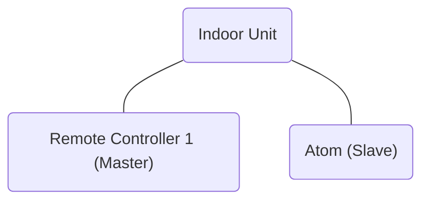
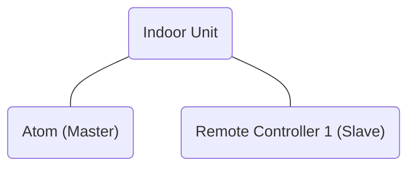
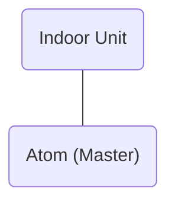

# Fuji-Atom Interface for [HomeSpan](https://github.com/HomeSpan/HomeSpan) and [ESPHome](https://github.com/esphome/esphome)

 This work is licensed under a <a rel="license" href="http://creativecommons.org/licenses/by-nc-sa/4.0/">Creative Commons Attribution-NonCommercial-ShareAlike 4.0 International License</a>.

## Introduction 

The purpose of this project, via [HomeSpan](https://github.com/HomeSpan/HomeSpan) or [ESPHome](https://github.com/esphome/esphome), is to be able to control your Fuji-Electric Air Conditioning Indoor Unit from [HomeKit](https://en.wikipedia.org/wiki/HomeKit) or [Home Assistant](https://www.home-assistant.io/).

This is an interface between a Fuji-Electric Indoor Unit (with 3-Wires Remote Controller) and an Atom Lite (ESP32 based) device.

This interface was inspired by the project in the [Unreality's repo](https://github.com/unreality/FujiHK).

### Curiosity
[This](https://community.home-assistant.io/t/fujitsu-ac-heat-pump-integration-via-esphome-esp32/407610/80?u=fosv) is the first prototype I shared on [Home Assistant Community](https://community.home-assistant.io/).

## Platform

The tested version, so called [Atom Lite](https://shop.m5stack.com/collections/m5-controllers/products/atom-lite-esp32-development-kit), can be purchased on the offical site.

There is also a new version, [AtomS3 Lite](https://shop.m5stack.com/products/atoms3-lite-esp32s3-dev-kit), available for purchase on the official site.

> ***Pease note, I have not tested the Fuji-Atom Interface on the new AtomS3 Lite, I only notice that the power pins are unchanged and the pin-matching between the Atom Lite and the AtomS3 Lite is the following:***
> * ***G22 (Atom Lite) -> G5 (AtomS3 Lite)***
> * ***G19 (Atom Lite) -> G6 (AtomS3 Lite)***

## Files usage

### Directory Tree:
* Fuji_HK_V1_Rev2.0.zip

* Fuji_HK_V2_Rev1.5.zip

When the JLCPCB site prompts you to upload Gerber files, directly upload the "Fuji_HK_V***X***_Rev***X.X***.zip" archive you have chosen.

There are two versions of the circuit:
* **V1_Rev2.0 ->** powers the Atom @3.3V on the appropriate pin
* **V2_Rev1.5 ->** powers the Atom @5V on the appropriate pin
	
Choose the one you prefer, there is no difference in the final operation.

> ***I prefer to use **V2_Rev1.5** to complain the Atom Lite specifications.***

## Connection

### ⚠️ Please read the following instructions carefully, otherwise you may fry the PCB on your Indoor Unit ⚠

> Before accessing any internal part of the Indoor Unit or Remote Controller, make sure that you turn off the power to the Indoor Unit via the breaker in your electrical panel.  
> If there is no dedicated switch for the Indoor Unit in your electrical panel, is strongly recommended to turn off the main breaker.

**💡 You need to connect the Fuji-Atom Interface in parallel with Remote Controller 💡**

> You can connect the Fuji-Atom Interface in parallel to the ***terminal block of any Remote Controller*** or equally directly to the ***terminal block of the Indoor Unit*** where you will already find the 3-Wires Harness of the Remote Controller(s) already installed.

### Master/Slave configuration
Fuji's indoor units can be controlled by a maximum of two Remote Controllers.  
So, if you already have two Remote Controllers, you must disconnect one of them (preferably the Slave) in order to install the Fuji-Atom Interface.  
Then, the Fuji-Atom Interface will replace one of the two Remote Controllers.

There are three possible configurations:
* **Remote Controller = Master Unit --- & --- Atom = Slave Unit** (Suggested)  
To do so, make sure the Atom is **set via firmware** to be a **Slave Unit** (If you use the [Unreality's firmware](https://github.com/unreality/FujiHK#secondary-mode), it will **automatically set itself as a Slave Unit**).  
Also, make sure that **DIP-Switch 1-No.2** of the existing Remote Controller is set to **OFF** so that it assumes the role of the **Master Unit**.

* **Remote Controller = Slave Unit --- & --- Atom = Master Unit**  
In this configuration you have to set **DIP-Switch 1-No.2** of the exixting Remote Controller to **ON** while you have to set the Atom via firmware to be the Master Unit (Not recommended because **a Slave Unit will not work in the absence of a Master Unit**, so if the Atom dies you will not be able to control the Indoor Unit via Remote Controller).

* **Remote Controller = Not present --- & --- Atom = Master Unit**  
If you strangely do not have a Remote Controller, you only need to set the Atom via firmware to be the Master Unit.

### Wiring

Connect the wires in this way:

* **Red   (on Indoor Unit or Remote Controller)  ->  12V (on Fuji-Atom Interface)**
* **White (on Indoor Unit or Remote Controller)  ->  LIN (on Fuji-Atom Interface)**
* **Black (on Indoor Unit or Remote Controller)  ->  GND (on Fuji-Atom Interface)**

Complete [Installation Manual of UTY-RNNUM Remote Controller (3-Wires)](https://manuals.plus/fujitsu/uty-rnnum-air-conditioner-remote-controller-manual#53_connection_of_remote_controller_cable)

## Components availability

In case a component is not available, replace it with one of equal characteristics.  
("Description" column of the BoM)

Components of equal characteristics on the BoM can be found by typing the part number on [Octopart](https://octopart.com/).  
("Manufacturer Code" column of the BoM)

As for the capacitors, do not get stuck on the choice of temperature coefficient on the BoM if you should not find it, but quietly 
choose from these nine values: X5S X5R X5P X6S X6R X6P X7S X7R X7P.  
(The scale is: from the "worst" X5S, to the best X7P).  

**🚫 Be careful, the two ICs (IC1 and U1) cannot be replaced because of different pins layout 🚫**

## Assembly
Since the PCB is designed for **SMT** (Surface-Mount Technology), **you need** to ask the PCB manufacturer to provide you with the **solder paste stencil**, you can find it under "SMT-Stencil".

Than you can easily follow this procedure:
1) Apply solder paste to the PCB using the solder paste stencil;
2) Place the components with tweezers (pay attention to components orientation where specified);
3) Heat the PCB around 150°-250°C (depends on the solder paste) with a hot air gun or a heating plate.

This procedure is much easier and safer if done by heated plate instead of hot air gun.

So basically, you will need three things:
- Heating Plate (also known as Reflow Station)
- Solder paste
- Tweezers 

Here's a [cheap Heating Plate on AliExpress](https://it.aliexpress.com/item/1005005424633746.html?spm=a2g0o.detail.1000014.2.208a5652LquwCk&gps-id=pcDetailBottomMoreOtherSeller&scm=1007.40000.326746.0&scm_id=1007.40000.326746.0&scm-url=1007.40000.326746.0&pvid=6fe93237-1ef7-4de2-b9d2-0f43d336fd63&_t=gps-id:pcDetailBottomMoreOtherSeller,scm-url:1007.40000.326746.0,pvid:6fe93237-1ef7-4de2-b9d2-0f43d336fd63,tpp_buckets:668%232846%238109%23254&pdp_npi=3%40dis%21EUR%2155.57%2121.67%21%21%21%21%21%40211b440316839759510703220e4299%2112000033015765110%21rec%21IT%21136216182).

## Bill of Materials

| Manufacturer Code | Description | Designer | Notes | Replaceable |
| ----------------- | ----------- | -------- | ----- | ----------- |
| MCP2025-330E/MD | IC TRANSCEIVER HALF 1/1 8DFN | IC1 | For both designs | N |
| TPS82140SILR | DC DC CONVERTER 0.9-6V | U1 | For both designs | N |
| C2012X5R1C106M085AC | Capacitor 10UF 16V X5R 0805 | C1 | For both designs | Y |
| CL21A226MOQNNNE | Capacitor 22UF 16V X5R 0805 | C2 | For both designs | Y |
| C2012X5R1C106M085AC | Capacitor 10UF 16V X5R 0805 | C3 | For both designs | Y |
| RP73PF2A133KBTDF | Resistor SMD 133K OHM 0.1% 1/4W 0805 | R1 | For both designs | Y |
| **CPF0805B42K2E1** | Resistor SMD 42.2K OHM 0.1% 1/10W 0805 | **R2** | Only for "V1_ Rev2.0" design (sets up the DC/DC converter to 3.3V) | Y |
| **RP73PF2A24K9BTDF** | Resistor SMD 24.9K OHM 0.1% 1/4W 0805 | **R2** | Only for "V2_ Rev1.5" design (sets up the DC/DC converter to 5V) | Y |
| CRT0805-BY-1002ELF | Resistor SMD 10K OHM 0.1% 1/8W 0805 | R3 | For both designs | Y |
| PTN0805Y5000BST1 | Resistor SMD 500 OHM 0.1% 1/8W 0805 | R4 | For both designs | Y |
| 150080VS75000 | LED GREEN CLEAR 0805 SMD | L1 | For both designs | Y |
| TSM-105-01-F-SV | Connector HEADER SMD 5POS 2.54MM | J1 | For both designs | Y |
| TSM-104-01-F-SV | Connector HEADER SMD 4POS 2.54MM | J2 | For both designs | Y |
| S3B-ZR-SM4A-TF(LF)(SN) | Connector HEADER SMD R/A 3POS 1.5MM | J3 | For both designs | Y |

## Schematic

## Model

